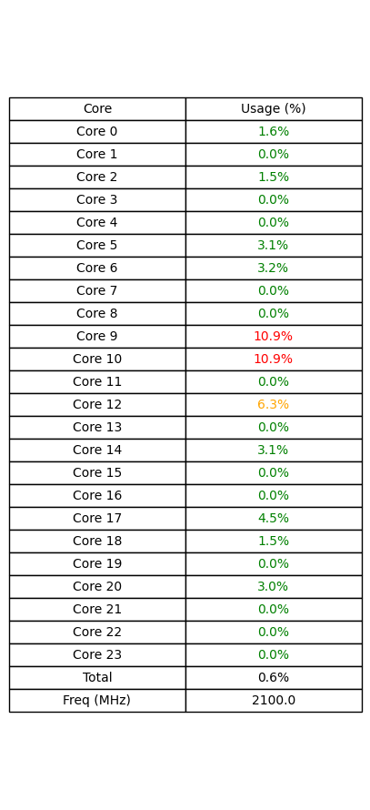
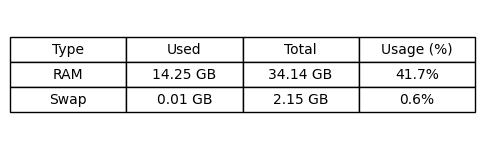
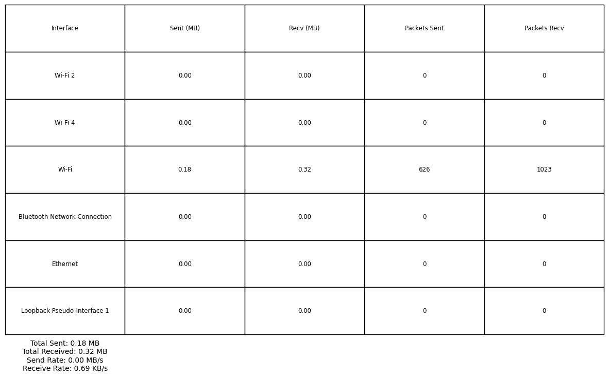
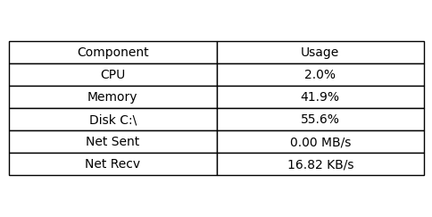

# 🖥️ System Monitor Tool

A lightweight Python-based system monitoring tool that reports CPU, memory, disk, and network usage in real-time. It provides:

- 🔍 Bottleneck detection with thresholds
- 📊 Rich terminal output and PNG image exports
- 📁 Modular structure for clean testing and maintenance

---

## 📸 Preview Charts

### 🔧 CPU Usage Table


> This chart shows per-core CPU utilization, total usage, and current clock speed (in MHz). Useful to identify uneven load distribution or high usage trends.

---

### 🧠 Memory Usage Table


> Displays RAM and swap memory stats: used, total, and usage %. Helpful for catching memory leaks or swap overuse.

---

### 💽 Disk Usage Table


> Lists each partition’s usage, total space, and mount point. Warns when any disk crosses threshold limits (default: 80%/90%).

---

### 🌐 Network Usage Table


> Shows per-interface bandwidth: sent/received bytes and packet counts. Includes a live snapshot of send/receive rate.

---

### 🚨 Bottleneck Summary Table


> Aggregated system usage across all components. Highlights any resource exceeding warning/critical thresholds.

---

## 🧰 Features

- ✅ Per-component monitoring (CPU, Memory, Disk, Network)
- ✅ Bottleneck detection with alert thresholds
- ✅ `rich` CLI UI for real-time terminal output
- ✅ PNG export of usage tables (`matplotlib`)
- ✅ Modular structure with tests and loggers
- ✅ CSV log support (`utils/logger_*.py`)

---

## 🛠️ Installation

```bash
git clone https://github.com/your-username/System-Monitor-Tool.git
cd System-Monitor-Tool
pip install -r requirements.txt
```

## 🚀 Running
 
 - Run a component test:
 - python tests/test_cpu.py
 - python tests/test_memory.py

 - Generate usage chart as PNG:
 - python utils/logger_cpu.py
 - python utils/logger_memory.py

 - Run full bottleneck check:
 - python monitor/alerts.py


## 📂 Project Structure
monitor/         → Core system checks (cpu.py, memory.py, etc.)
tests/           → Unit-level checks per component
utils/           → Loggers & chart exporters (PNG/CSV)
first_demo_charts/ → Output images of system usage
main.py          → (Placeholder for future integration)


# 📌 Future Plans

✅ **Convert to a live, continuous background process**  
The tool will run in the background, collecting data automatically without requiring manual execution.

✅ **Package as a local desktop app (no cloud, no tracking)**  
It will be installable as a standalone app that runs entirely on the user's machine—private and offline.

🖥️ **GUI frontend using Tkinter, Electron, or PyQt**  
Plan to build a user-friendly interface for viewing system metrics and charts in real time.

🧠 **Real-time alerts and charts with rolling logs**  
Visual feedback and alerting system with automatic chart updates and live thresholds.

💾 **Export to local SQLite or structured CSV for historical analysis**  
Enable time-series storage to review long-term performance and resource patterns.

🛑 **System tray integration to toggle monitoring on/off**  
Minimal UX impact—users can enable/disable monitoring via the system tray with one click.


